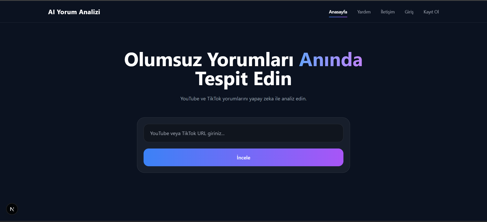
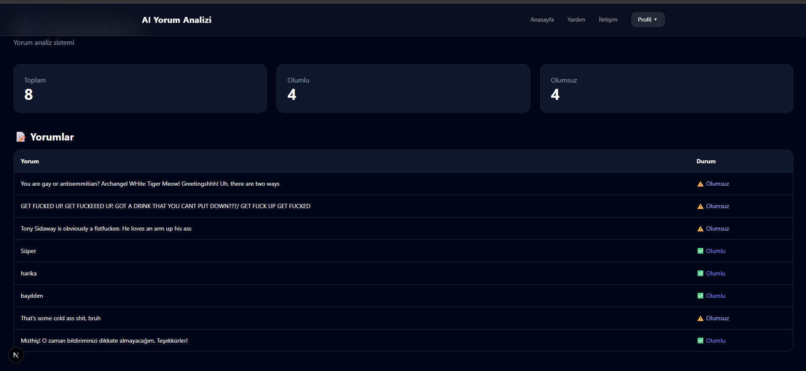
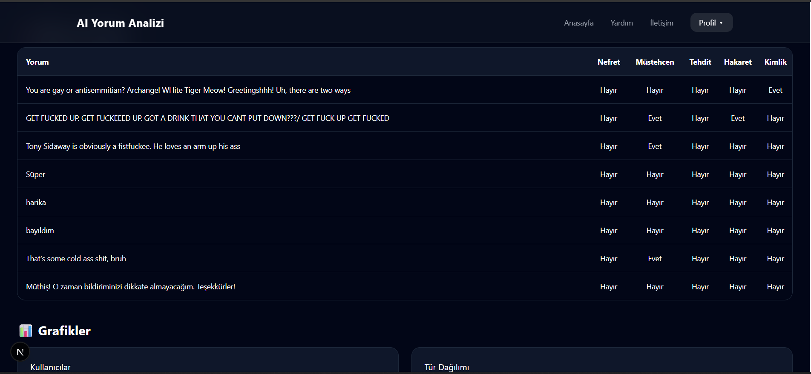
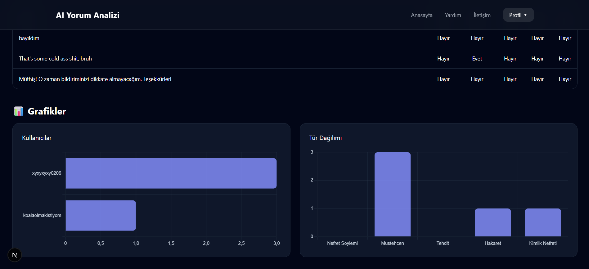

# Yapay Zeka ile Sosyal Medyadaki Nefret İçerikli Yorumların Tespiti

Bu proje, sosyal medya platformlarındaki yorumları yapay zeka ve doğal dil işleme teknikleri kullanarak analiz etmek ve nefret söylemi içeren içerikleri tespit etmek amacıyla geliştirilmiştir.

## Özellikler

- YouTube yorum analizi
- TikTok yorum analizi
- Nefret söylemi tespiti
- Müstehcen içerik analizi
- Yapay zeka destekli yorum sınıflandırma
- Kullanıcı giriş/kayıt sistemi
- Admin paneli
- Grafik ve veri analizi ekranları

## Kullanılan Teknolojiler

### Frontend
- Next.js
- React
- Tailwind CSS

### Backend
- FastAPI
- Python

### Veritabanı
- MSSQL

### Yapay Zeka / NLP
- Transformers
- Makine Öğrenmesi
- Doğal Dil İşleme (NLP)

## Proje Görselleri

### Ana Panel


### Yorum Analizi





## Kurulum

### Frontend

```bash
cd frontend
npm install
npm run dev
```

### Backend

```bash
cd backend
pip install -r requirements.txt
py -3.13 -m uvicorn main:app --reload

```md
Not: Python 3.13 yüklü olmalıdır.
```

## Ortam Değişkenleri (.env)

Projeyi çalıştırmak için gerekli API anahtarlarını ve veritabanı bilgilerini `.env` dosyasına ekleyin.

Örnek:

```env
YOUTUBE_API_KEY=your_api_key
DB_USER=your_username
DB_PASSWORD=your_password
JWT_SECRET=your_secret
```

## Projenin Amacı

Bu proje, sosyal medya platformlarında yer alan zararlı ve nefret içerikli yorumların otomatik olarak tespit edilmesini sağlayarak içerik denetimine katkı sunmayı amaçlamaktadır.
